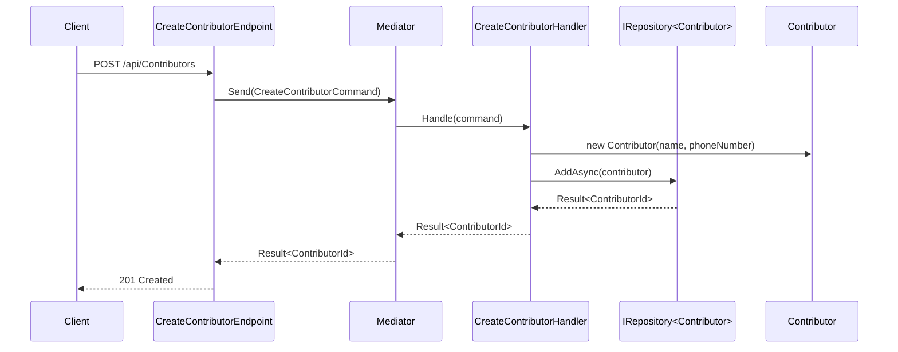

# 📋 PLAN: .NET Knowledge Base Generator

> **Hybrid Layered KB** — Python CLI that scans .NET projects and produces LLM-friendly Markdown knowledge bases with incremental update support.

---

## Overview

### What
A Python CLI tool (`kb_generator`) that analyzes local .NET/C# projects and produces a structured, multi-layered Markdown knowledge base optimized for LLM consumption. The KB supports incremental updates via file-hash tracking, so only changed files are re-processed on subsequent runs.

### Why
AI coding assistants (Claude, GPT, Copilot) work best when given structured project context. Manually writing and maintaining project documentation is tedious and drifts from reality. This tool auto-generates an always-up-to-date knowledge base that can be pasted into LLM context windows or used in RAG pipelines.

### Target Users
- Developers using AI assistants with .NET codebases
- Teams wanting to onboard AI tools onto existing projects
- Anyone needing structured, machine-readable documentation for .NET solutions

---

## Project Type

**BACKEND** — Python CLI tool (no UI, no web, no mobile)

---

## Success Criteria

| # | Criterion | Measurement |
|---|-----------|-------------|
| 1 | Scans a .NET solution and produces a complete `.kb/` directory | Run against `CleanArchitecture` repo → all KB files generated |
| 2 | KB output is LLM-friendly | YAML frontmatter + structured Markdown + code blocks with signatures |
| 3 | Incremental updates work | Modify 1 `.cs` file → `update` command only re-processes that file + affected KB docs |
| 4 | CLI has 3 commands: `scan`, `update`, `refresh` | All 3 commands work correctly via `python kb_gen.py <command> <path>` |
| 5 | Handles multi-project solutions | Works with `CleanArchitecture` (6 src projects + 4 test projects) |
| 6 | Completes scan in < 30 seconds | For medium-sized solutions (~100 .cs files) |
| 7 | Output is human-reviewable | A developer can read the KB and find it accurate and useful |
| 8 | **Main flows detected** | Traces complete request flows: `Endpoint → Command → Handler → Repository → Entity` with all intermediate DI hops |
| 9 | **Change impact analysis works** | Given a changed `.cs` file → `impact` command reports affected flows, KB sections, dependent classes, and test files |
| 10 | **Flow documentation generated** | `flows/` directory contains per-flow Markdown with Mermaid sequence diagrams |

---

## Tech Stack

| Technology | Purpose | Rationale |
|------------|---------|-----------|
| **Python 3.11+** | Core language | Fast scripting, great text processing, user already has Python |
| **tree-sitter + tree-sitter-c-sharp** | C# parsing | Parse `.cs` files without needing `dotnet` SDK; accurate AST-level extraction |
| **Click** | CLI framework | Clean command/subcommand structure, auto-generated help |
| **PyYAML** | YAML frontmatter | For generating structured metadata in Markdown files |
| **Jinja2** | Template rendering | Generate consistent Markdown output from templates |
| **hashlib (stdlib)** | File checksums | SHA256 hashing for incremental change detection |
| **pathlib (stdlib)** | File operations | Cross-platform path handling |
| **json (stdlib)** | State tracking | `.kb-state.json` for tracking file hashes and metadata |
| **dataclasses (stdlib)** | Data models | Clean internal data representations |

---

## File Structure

```
knowledge-base-generator/
├── kb_gen.py                      # CLI entry point
├── pyproject.toml                 # Project config + dependencies
├── README.md                      # Usage documentation
│
├── kb_generator/                  # Main package
│   ├── __init__.py
│   ├── cli.py                     # Click CLI commands (scan, update, refresh)
│   ├── config.py                  # Configuration and constants
│   │
│   ├── parsers/                   # File parsing layer
│   │   ├── __init__.py
│   │   ├── csharp_parser.py       # tree-sitter C# parser → extracts classes, methods, etc.
│   │   ├── csproj_parser.py       # .csproj XML parser → project refs, NuGet packages
│   │   ├── solution_parser.py     # .sln/.slnx parser → solution structure
│   │   └── models.py              # Data models (ClassInfo, MethodInfo, ProjectInfo, etc.)
│   │
│   ├── analyzers/                 # Semantic analysis layer
│   │   ├── __init__.py
│   │   ├── architecture_analyzer.py  # Detects layers, project dependencies
│   │   ├── pattern_detector.py       # Detects patterns (CQRS, Repository, DDD, etc.)
│   │   ├── dependency_analyzer.py    # Maps class → class dependencies (DI, inheritance)
│   │   ├── flow_analyzer.py          # 🆕 Traces request flows (Endpoint→Handler→Repo→Entity)
│   │   ├── impact_analyzer.py        # 🆕 Predicts impact of file changes on flows & KB
│   │   └── test_mapper.py            # Maps test projects → what they cover
│   │
│   ├── generators/                # Markdown generation layer
│   │   ├── __init__.py
│   │   ├── summary_generator.py   # Generates SUMMARY.md (condensed overview)
│   │   ├── architecture_generator.py  # Generates architecture/overview.md
│   │   ├── domain_generator.py    # Generates domain/*.md (aggregates, entities)
│   │   ├── usecase_generator.py   # Generates use-cases/*.md (commands, queries)
│   │   ├── infra_generator.py     # Generates infrastructure/*.md
│   │   ├── api_generator.py       # Generates api/*.md (endpoints)
│   │   ├── test_generator.py      # Generates tests/*.md
│   │   ├── flow_generator.py      # 🆕 Generates flows/*.md (Mermaid diagrams)
│   │   └── impact_generator.py    # 🆕 Generates impact report Markdown
│   │
│   ├── templates/                 # Jinja2 Markdown templates
│   │   ├── summary.md.j2
│   │   ├── architecture.md.j2
│   │   ├── domain_aggregate.md.j2
│   │   ├── usecase_group.md.j2
│   │   ├── infrastructure.md.j2
│   │   ├── api_endpoints.md.j2
│   │   └── test_coverage.md.j2
│   │
│   ├── state/                     # Incremental update tracking
│   │   ├── __init__.py
│   │   ├── tracker.py             # File hash tracking + change detection
│   │   └── models.py              # StateFile, FileHash dataclasses
│   │
│   └── utils/                     # Shared utilities
│       ├── __init__.py
│       ├── file_utils.py          # File discovery, reading, glob patterns
│       └── markdown_utils.py      # YAML frontmatter helpers, Markdown formatting
│
├── tests/                         # Test suite
│   ├── __init__.py
│   ├── test_csharp_parser.py
│   ├── test_csproj_parser.py
│   ├── test_pattern_detector.py
│   ├── test_state_tracker.py
│   ├── test_generators.py
│   └── fixtures/                  # Sample .cs files for testing
│       ├── sample_entity.cs
│       ├── sample_command.cs
│       └── sample_csproj.xml
│
└── CleanArchitecture/             # Test target (already cloned)
```

### Output KB Structure (generated)

```
<target-project>/.kb/
├── SUMMARY.md                     # Condensed overview (~3K-8K tokens)
├── architecture/
│   └── overview.md                # Solution structure, project deps, layer diagram
├── domain/
│   ├── _index.md                  # All aggregates/entities listed
│   └── ContributorAggregate.md    # Entity + VOs + Events + Specs breakdown
├── use-cases/
│   ├── _index.md                  # All commands/queries listed
│   └── contributors.md            # CRUD operations grouped
├── infrastructure/
│   ├── data-access.md             # DbContext, Repositories, EF Config
│   └── external-services.md       # Email, 3rd party integrations
├── api/
│   └── endpoints.md               # All HTTP endpoints with routes & DTOs
├── flows/                          # 🆕 Request flow documentation
│   ├── _index.md                  # All flows listed with entry points
│   ├── _dependency-graph.md       # Full class-level dependency graph
│   ├── create-contributor.md      # Flow: POST → CreateContributorCommand → Handler → Repo
│   ├── update-contributor.md      # Flow: PUT → UpdateContributorCommand → Handler → Repo
│   └── ...                        # One file per detected flow
├── impact/                         # 🆕 Change impact analysis
│   ├── _index.md                  # Impact analysis reference guide
│   └── impact-map.md             # File → affected flows/classes/tests map
├── tests/
│   └── coverage-map.md            # Test projects → what they cover
├── packages/
│   └── dependencies.md            # NuGet packages with versions & purposes
└── .kb-state.json                 # File checksums + last update timestamps
```

---

## Task Breakdown

### Phase 1: Project Foundation
> **Goal:** Set up the Python project with dependencies and CLI skeleton

---

#### Task 1.1: Initialize Python Project

| Field | Value |
|-------|-------|
| **Agent** | backend-specialist |
| **Priority** | P0 |
| **Dependencies** | None |
| **Estimated Time** | 5 min |

**INPUT:** Empty project directory
**OUTPUT:** `pyproject.toml` with dependencies, `kb_gen.py` entry point, `kb_generator/` package with `__init__.py`
**VERIFY:** `pip install -e .` succeeds, `python kb_gen.py --help` shows usage

**Details:**
- Create `pyproject.toml` with:
  - `tree-sitter==0.24.0`, `tree-sitter-c-sharp` 
  - `click>=8.1`, `pyyaml>=6.0`, `jinja2>=3.1`
  - Dev dependencies: `pytest>=7.0`
- Create `kb_gen.py` as thin entry point
- Create `kb_generator/__init__.py`

---

#### Task 1.2: Build CLI Framework

| Field | Value |
|-------|-------|
| **Agent** | backend-specialist |
| **Priority** | P0 |
| **Dependencies** | Task 1.1 |
| **Estimated Time** | 8 min |

**INPUT:** Project with dependencies installed
**OUTPUT:** `kb_generator/cli.py` with 3 commands: `scan`, `update`, `refresh`
**VERIFY:** `python kb_gen.py scan --help`, `python kb_gen.py update --help`, `python kb_gen.py refresh --help` all show correct usage

**Details:**
- `scan <path>` — Full initial scan, generates `.kb/` directory
  - Options: `--output-dir` (default: `<path>/.kb`), `--verbose`
- `update <path>` — Incremental update, only re-process changed files
  - Options: `--output-dir`, `--verbose`
- `refresh <path>` — Force full re-scan (deletes state, runs scan)
  - Options: `--output-dir`, `--verbose`
- All commands validate that `<path>` exists and contains `.sln`/`.slnx`/`.csproj` files

---

#### Task 1.3: Create Data Models

| Field | Value |
|-------|-------|
| **Agent** | backend-specialist |
| **Priority** | P0 |
| **Dependencies** | Task 1.1 |
| **Estimated Time** | 10 min |

**INPUT:** Understanding of .NET code structure
**OUTPUT:** `kb_generator/parsers/models.py` with all data classes
**VERIFY:** Models can be instantiated, serialized to dict, used in type hints

**Details — Core models:**

```python
@dataclass
class ClassInfo:
    name: str
    namespace: str
    file_path: str
    base_classes: list[str]
    interfaces: list[str]
    properties: list[PropertyInfo]
    methods: list[MethodInfo]
    constructors: list[ConstructorInfo]
    attributes: list[str]       # e.g., [ApiController], [Authorize]
    generic_params: list[str]
    xml_doc: str | None
    class_kind: str             # "class", "record", "struct", "enum", "interface"

@dataclass
class PropertyInfo:
    name: str
    type_name: str
    accessors: str              # "get; set;", "get; private set;", etc.
    attributes: list[str]

@dataclass
class MethodInfo:
    name: str
    return_type: str
    parameters: list[ParameterInfo]
    modifiers: list[str]        # async, virtual, override, static
    xml_doc: str | None

@dataclass
class ProjectInfo:
    name: str
    path: str
    sdk: str                    # e.g., "Microsoft.NET.Sdk.Web"
    target_framework: str
    project_references: list[str]
    package_references: list[PackageRef]
    source_files: list[str]

@dataclass
class SolutionInfo:
    name: str
    path: str
    projects: list[ProjectInfo]

@dataclass
class PackageRef:
    name: str
    version: str | None

@dataclass
class DomainAggregate:
    """Analyzed aggregate — combines parsed data with detected patterns."""
    root_entity: ClassInfo
    value_objects: list[ClassInfo]
    domain_events: list[ClassInfo]
    specifications: list[ClassInfo]
    event_handlers: list[ClassInfo]

@dataclass
class UseCaseInfo:
    """Analyzed use case — command/query + handler + dependencies."""
    command_or_query: ClassInfo
    handler: ClassInfo
    pattern: str                # "Command", "Query"
    dependencies: list[str]     # Constructor-injected types

@dataclass
class EndpointInfo:
    """API endpoint extracted from FastEndpoints/Controllers."""
    route: str
    http_method: str
    handler_class: str
    request_type: str | None
    response_type: str | None
    file_path: str
```

---

### Phase 2: Parsing Layer
> **Goal:** Extract structured data from .NET source files

---

#### Task 2.1: Solution/Project Parser

| Field | Value |
|-------|-------|
| **Agent** | backend-specialist |
| **Priority** | P0 |
| **Dependencies** | Task 1.3 |
| **Estimated Time** | 10 min |

**INPUT:** Path to `.sln`/`.slnx` file or directory containing `.csproj` files
**OUTPUT:** `kb_generator/parsers/solution_parser.py` + `kb_generator/parsers/csproj_parser.py`
**VERIFY:** Parse `CleanArchitecture/Clean.Architecture.slnx` → returns `SolutionInfo` with 10 projects, correct references

**Details:**
- `.slnx` parser: XML-based, extract project paths
- `.sln` parser: Regex-based, extract `Project(...)` entries
- `.csproj` parser: XML (ElementTree), extract:
  - `<ProjectReference>` → project dependencies
  - `<PackageReference>` → NuGet packages (with version from `Directory.Packages.props` if central versioning)
  - SDK type (`Microsoft.NET.Sdk.Web`, etc.)
  - Target framework
- Auto-detect `Directory.Packages.props` for central package versioning

---

#### Task 2.2: C# Parser (tree-sitter)

| Field | Value |
|-------|-------|
| **Agent** | backend-specialist |
| **Priority** | P0 |
| **Dependencies** | Task 1.3 |
| **Estimated Time** | 25 min |

**INPUT:** `.cs` source files
**OUTPUT:** `kb_generator/parsers/csharp_parser.py` that returns `list[ClassInfo]` per file
**VERIFY:** Parse `Contributor.cs` → returns `ClassInfo` with correct name, namespace, base classes, properties, methods

**Details — Must extract:**
- **Namespaces** (both block-scoped and file-scoped)
- **Classes, records, structs, interfaces, enums** with:
  - Name, generic parameters
  - Base classes and interfaces
  - Properties (name, type, accessors)
  - Methods (name, return type, parameters, modifiers)
  - Constructors (including primary constructors like `class Foo(IBar bar)`)
  - Attributes (`[ApiController]`, `[Authorize]`, etc.)
- **XML doc comments** (`/// <summary>`)
- **Using directives** (for namespace resolution)
- **Enum members** with values

**tree-sitter node types to handle:**
- `class_declaration`, `record_declaration`, `struct_declaration`, `interface_declaration`, `enum_declaration`
- `property_declaration`, `method_declaration`, `constructor_declaration`
- `parameter_list`, `type_parameter_list`
- `attribute_list`
- `xml_comment` (if available in grammar)
- `file_scoped_namespace_declaration`, `namespace_declaration`

---

#### Task 2.3: File Discovery Utility

| Field | Value |
|-------|-------|
| **Agent** | backend-specialist |
| **Priority** | P0 |
| **Dependencies** | Task 1.1 |
| **Estimated Time** | 5 min |

**INPUT:** Root directory path
**OUTPUT:** `kb_generator/utils/file_utils.py` with functions to discover files
**VERIFY:** Discovers all `.cs`, `.csproj`, `.sln`, `.slnx` files; excludes `bin/`, `obj/`, `.git/`

**Details:**
```python
def discover_solution_files(root: Path) -> list[Path]: ...
def discover_project_files(root: Path) -> list[Path]: ...
def discover_cs_files(root: Path) -> list[Path]: ...
def compute_file_hash(path: Path) -> str: ...  # SHA256
```
- Respect `.gitignore` patterns (or use hardcoded exclusions: `bin/`, `obj/`, `.git/`, `node_modules/`)
- Traverse recursively

---

### Phase 3: Analysis Layer
> **Goal:** Derive semantic meaning from parsed data (patterns, relationships, architecture)

---

#### Task 3.1: Architecture Analyzer

| Field | Value |
|-------|-------|
| **Agent** | backend-specialist |
| **Priority** | P1 |
| **Dependencies** | Task 2.1 |
| **Estimated Time** | 10 min |

**INPUT:** `SolutionInfo` with all `ProjectInfo`
**OUTPUT:** `kb_generator/analyzers/architecture_analyzer.py`
**VERIFY:** Correctly identifies layers (Core, Infrastructure, UseCases, Web) and their dependency directions

**Details:**
- Build project dependency graph from `<ProjectReference>` data
- Detect layer types by heuristics:
  - Contains `EntityBase`, `IAggregateRoot` → **Domain/Core** layer
  - Contains `DbContext`, `Repository` → **Infrastructure** layer
  - Contains `ICommand`, `IQuery`, `Handler` → **Use Cases / Application** layer
  - Contains `Endpoint`, `Controller`, `Program.cs` with `WebApplication` → **Web/API** layer
  - Contains test framework packages (`xunit`, `NUnit`) → **Test** layer
- Validate dependency directions (Core should not reference Infrastructure, etc.)

---

#### Task 3.2: Pattern Detector

| Field | Value |
|-------|-------|
| **Agent** | backend-specialist |
| **Priority** | P1 |
| **Dependencies** | Task 2.2 |
| **Estimated Time** | 15 min |

**INPUT:** Parsed `ClassInfo` from all source files
**OUTPUT:** `kb_generator/analyzers/pattern_detector.py`
**VERIFY:** Detects CQRS, Repository, DDD Aggregate, Specification, Domain Events patterns in `CleanArchitecture`

**Details — Patterns to detect:**

| Pattern | Detection Heuristic |
|---------|---------------------|
| **Aggregate Root** | Class implements `IAggregateRoot` |
| **Value Object** | Class generated by Vogen, or extends `ValueObject` |
| **Domain Event** | Class implements/extends `DomainEventBase` or similar, or lives in `Events/` folder |
| **Event Handler** | Class implements `INotificationHandler<T>` or `IDomainEventHandler<T>` |
| **Command (CQRS)** | Record/Class implements `ICommand<T>` or `IRequest<T>` with "Command" in name |
| **Query (CQRS)** | Record/Class implements `IQuery<T>` or `IRequest<T>` with "Query" in name |
| **Command/Query Handler** | Class implements `ICommandHandler<T>` or `IQueryHandler<T>` or `IRequestHandler<T>` |
| **Repository** | Class implements `IRepository<T>` or extends `RepositoryBase<T>` |
| **Specification** | Class extends `Specification<T>` |
| **FastEndpoint** | Class extends `Endpoint<TRequest, TResponse>` or similar |
| **Controller** | Class has `[ApiController]` attribute or extends `ControllerBase` |
| **EF Configuration** | Class implements `IEntityTypeConfiguration<T>` |
| **Service** | Interface in `Interfaces/` folder + implementation in Infrastructure |
| **DTO / Record** | Record with only properties, typically in UseCases layer |
| **Smart Enum** | Class extends `SmartEnum<T>` |

---

#### Task 3.3: Dependency Analyzer

| Field | Value |
|-------|-------|
| **Agent** | backend-specialist |
| **Priority** | P1 |
| **Dependencies** | Task 2.2, Task 3.2 |
| **Estimated Time** | 10 min |

**INPUT:** Parsed classes with constructors and interfaces
**OUTPUT:** `kb_generator/analyzers/dependency_analyzer.py`
**VERIFY:** For `CreateContributorHandler`, detects dependency on `IRepository<Contributor>`

**Details:**
- Extract constructor parameters → these are DI dependencies
- Map interface → implementation (by scanning all classes for `implements` relationships)
- Group by: Commands → Handlers, Handlers → Repositories, etc.
- Build use-case flow chains: `Endpoint → Command → Handler → Repository → Entity`

---

#### Task 3.4: Test Mapper

| Field | Value |
|-------|-------|
| **Agent** | backend-specialist |
| **Priority** | P2 |
| **Dependencies** | Task 2.1, Task 2.2 |
| **Estimated Time** | 8 min |

**INPUT:** Test project files
**OUTPUT:** `kb_generator/analyzers/test_mapper.py`
**VERIFY:** Maps `Clean.Architecture.UnitTests` → Core layer, `FunctionalTests` → Web layer

**Details:**
- Detect test framework (xunit, NUnit, MSTest) from package references
- Map test projects to source projects via `<ProjectReference>`
- Count test classes and test methods per project
- Identify test patterns (unit, integration, functional, E2E)

---

### Phase 4: Generation Layer
> **Goal:** Produce LLM-friendly Markdown knowledge base files

---

#### Task 4.1: Markdown Utilities + Templates

| Field | Value |
|-------|-------|
| **Agent** | backend-specialist |
| **Priority** | P1 |
| **Dependencies** | Task 1.1 |
| **Estimated Time** | 10 min |

**INPUT:** Template requirements from output spec
**OUTPUT:** `kb_generator/utils/markdown_utils.py` + all `templates/*.md.j2` files
**VERIFY:** Templates render valid Markdown with correct YAML frontmatter

**Details:**
- YAML frontmatter helper:
  ```python
  def render_frontmatter(metadata: dict) -> str:
      """Returns '---\ntitle: ...\n---\n'"""
  ```
- Template for each KB section (see file structure above)
- Each template must produce:
  - YAML frontmatter with: `title`, `type`, `generated_at`, `source_files`
  - Structured headings (H2, H3)
  - Code blocks with `csharp` language tag for signatures
  - Tables for quick-reference data
  - Cross-references between KB documents (relative links)

---

#### Task 4.2: Summary Generator

| Field | Value |
|-------|-------|
| **Agent** | backend-specialist |
| **Priority** | P1 |
| **Dependencies** | Task 3.1, Task 4.1 |
| **Estimated Time** | 10 min |

**INPUT:** All analyzed data (solution, architecture, patterns, use cases)
**OUTPUT:** `kb_generator/generators/summary_generator.py` → generates `SUMMARY.md`
**VERIFY:** Generated `SUMMARY.md` is < 8K tokens, covers all layers, is self-contained for LLM use

**Details — SUMMARY.md structure:**
1. **Project Identity** — Name, framework, architecture style
2. **Layer Diagram** — Text-based (ASCII) project dependency diagram
3. **Technology Stack** — Key NuGet packages with purpose
4. **Domain Model Overview** — Aggregates, entities, value objects (names + key properties)
5. **Use Case Catalogue** — Commands and Queries with one-line descriptions
6. **API Surface** — Endpoints with routes and HTTP methods
7. **Test Coverage** — Test projects and what they cover
8. **Key Patterns** — Patterns detected (CQRS, DDD, Repository, etc.)

---

#### Task 4.3: Domain Generator

| Field | Value |
|-------|-------|
| **Agent** | backend-specialist |
| **Priority** | P1 |
| **Dependencies** | Task 3.2, Task 4.1 |
| **Estimated Time** | 10 min |

**INPUT:** Detected aggregates, entities, value objects, domain events
**OUTPUT:** `kb_generator/generators/domain_generator.py` → generates `domain/_index.md` + per-aggregate files
**VERIFY:** `ContributorAggregate.md` includes entity, VOs (ContributorName, PhoneNumber), events, specs

**Details — Per aggregate file includes:**
- Full class signature with base classes
- Properties table (name, type, access)
- Methods with signatures
- Related Value Objects with their definitions
- Domain Events raised
- Specifications defined
- Event Handlers that respond to events

---

#### Task 4.4: Architecture + Infrastructure + API + Use Case + Test Generators

| Field | Value |
|-------|-------|
| **Agent** | backend-specialist |
| **Priority** | P1 |
| **Dependencies** | Task 3.1, Task 3.2, Task 3.3, Task 3.4, Task 4.1 |
| **Estimated Time** | 20 min |

**INPUT:** All analyzed data
**OUTPUT:** Remaining generators: `architecture_generator.py`, `infra_generator.py`, `api_generator.py`, `usecase_generator.py`, `test_generator.py`
**VERIFY:** All KB files generated for `CleanArchitecture` repo, no empty files

**Details:**
- **architecture/overview.md** — Solution map, project dependencies, layer diagram, dependency rule validation
- **infrastructure/data-access.md** — DbContext, EF configurations, repositories, migrations summary
- **infrastructure/external-services.md** — Email senders, 3rd party integrations
- **api/endpoints.md** — All FastEndpoints/Controllers with routes, request/response types, validators
- **use-cases/_index.md** + **use-cases/contributors.md** — Commands, Queries, Handlers grouped by entity
- **tests/coverage-map.md** — Test project inventory with framework, target project, test count
- **packages/dependencies.md** — NuGet packages table with versions and detected purpose

---

### Phase 5: Incremental Update System
> **Goal:** Track file changes and only re-generate affected KB sections

---

#### Task 5.1: State Tracker

| Field | Value |
|-------|-------|
| **Agent** | backend-specialist |
| **Priority** | P1 |
| **Dependencies** | Task 2.3 |
| **Estimated Time** | 10 min |

**INPUT:** Source file paths
**OUTPUT:** `kb_generator/state/tracker.py` + `kb_generator/state/models.py`
**VERIFY:** First scan creates `.kb-state.json`; modify a file → `get_changed_files()` returns only that file

**Details:**
```python
@dataclass
class FileState:
    path: str
    sha256: str
    last_scanned: str  # ISO datetime
    size_bytes: int

@dataclass 
class KBState:
    version: str
    last_full_scan: str
    last_update: str
    files: dict[str, FileState]       # source path → state
    kb_outputs: dict[str, list[str]]  # KB file → source files it was generated from

class StateTracker:
    def load_state(self, kb_dir: Path) -> KBState | None: ...
    def save_state(self, kb_dir: Path, state: KBState) -> None: ...
    def compute_changes(self, root: Path, state: KBState) -> ChangeSet: ...

@dataclass
class ChangeSet:
    added: list[Path]
    modified: list[Path]
    deleted: list[Path]
    
    @property
    def has_changes(self) -> bool: ...
```

- `.kb-state.json` stores SHA256 hash + last scan time for every source file
- `kb_outputs` maps each generated KB file to its source files (for targeted regeneration)
- `compute_changes()` compares current file hashes against stored state

---

#### Task 5.2: Incremental Pipeline

| Field | Value |
|-------|-------|
| **Agent** | backend-specialist |
| **Priority** | P1 |
| **Dependencies** | Task 5.1, all Phase 4 tasks |
| **Estimated Time** | 12 min |

**INPUT:** `ChangeSet` from state tracker
**OUTPUT:** Updated pipeline in `cli.py` that supports incremental updates
**VERIFY:** Modify `Contributor.cs` → `update` only regenerates `domain/ContributorAggregate.md`, `SUMMARY.md`, and `_index.md` files

**Details:**
- `scan` command: Parse everything → Analyze → Generate all → Save state
- `update` command:
  1. Load existing state from `.kb-state.json`
  2. Compute `ChangeSet` (added/modified/deleted files)
  3. Re-parse only changed files
  4. Determine which KB documents are affected (via `kb_outputs` mapping)
  5. Re-generate only affected KB documents
  6. Always regenerate `SUMMARY.md` and `_index.md` files (lightweight)
  7. Update state
- `refresh` command: Delete `.kb-state.json` → run full `scan`

---

### Phase 6: Integration & Polish
> **Goal:** Wire everything together, test against real project, polish output

---

#### Task 6.1: End-to-End Integration

| Field | Value |
|-------|-------|
| **Agent** | backend-specialist |
| **Priority** | P0 |
| **Dependencies** | All Phase 1-5 tasks |
| **Estimated Time** | 15 min |

**INPUT:** All components built
**OUTPUT:** Working `scan` command against `CleanArchitecture` repo
**VERIFY:** `python kb_gen.py scan ./CleanArchitecture` produces complete `.kb/` directory with all expected files

**Details:**
- Wire parsers → analyzers → generators in `cli.py`
- Handle errors gracefully (unparseable files logged as warnings, not crashes)
- Add progress output (file count, parsing status, generation status)
- Ensure output directory creation (`mkdir -p` equivalent)

---

#### Task 6.2: Config File Support

| Field | Value |
|-------|-------|
| **Agent** | backend-specialist |
| **Priority** | P2 |
| **Dependencies** | Task 6.1 |
| **Estimated Time** | 8 min |

**INPUT:** Need for customizable behavior
**OUTPUT:** `kb_generator/config.py` with support for `.kb-config.yaml`
**VERIFY:** User can exclude projects/folders, customize output structure

**Details — `.kb-config.yaml`:**
```yaml
# Optional config file in project root
exclude_projects:
  - "*.Tests"
  - "*.AspireHost"
exclude_paths:
  - "**/Migrations/**"
output_dir: ".kb"
include_source_snippets: true    # Include code blocks in KB
max_method_body_lines: 10        # Truncate long method bodies
```

---

#### Task 6.3: Logging & Error Handling

| Field | Value |
|-------|-------|
| **Agent** | backend-specialist |
| **Priority** | P2 |
| **Dependencies** | Task 6.1 |
| **Estimated Time** | 5 min |

**INPUT:** Need for robust error handling
**OUTPUT:** Consistent logging across all modules, graceful failure modes
**VERIFY:** Malformed `.cs` file → warning logged, rest of scan continues

**Details:**
- Use Python `logging` module with configurable verbosity (`--verbose` flag)
- Parse errors → log warning with file path, skip file, continue
- Missing solution file → clear error message with suggestions
- Permission errors → skip with warning

---

#### Task 6.4: Write Tests

| Field | Value |
|-------|-------|
| **Agent** | test-engineer |
| **Priority** | P2 |
| **Dependencies** | All Phase 2-4 tasks |
| **Estimated Time** | 15 min |

**INPUT:** All parsers, analyzers, generators
**OUTPUT:** `tests/` directory with pytest tests
**VERIFY:** `pytest` passes all tests

**Details:**
- **Parser tests:** Feed sample `.cs` files → verify extracted `ClassInfo` is correct
- **csproj tests:** Feed sample `.csproj` → verify extracted packages and references
- **Pattern detector tests:** Feed known patterns → verify detection
- **State tracker tests:** Create state → modify file → verify change detection
- **Generator tests:** Feed analyzed data → verify generated Markdown structure
- Use `tests/fixtures/` for sample input files

---

### Phase 7: Documentation
> **Goal:** Make the tool easy to use and understand

---

#### Task 7.1: README & Usage Documentation

| Field | Value |
|-------|-------|
| **Agent** | documentation-writer |
| **Priority** | P2 |
| **Dependencies** | Task 6.1 |
| **Estimated Time** | 8 min |

**INPUT:** Working tool
**OUTPUT:** `README.md` with installation, usage, examples
**VERIFY:** New user can follow README and successfully generate KB for any .NET project

**Details:**
- Installation instructions (`pip install -e .`)
- Quick start (3-step: clone repo → install → scan)
- CLI reference (all commands with options)
- Output format documentation
- Configuration file reference
- Examples with `CleanArchitecture` repo
- Supported .NET patterns and frameworks

---

### Phase 8: Deep Flow Analysis
> **Goal:** Trace complete request flows through the codebase and build a class-level dependency graph that enables understanding how a request travels from API entry to database

---

#### Task 8.1: Class Dependency Graph Builder

| Field | Value |
|-------|-------|
| **Agent** | backend-specialist |
| **Priority** | P1 |
| **Dependencies** | Task 2.2, Task 3.2, Task 3.3 |
| **Estimated Time** | 15 min |

**INPUT:** All parsed `ClassInfo` with constructors, interfaces, and base classes
**OUTPUT:** `kb_generator/analyzers/dependency_graph.py` with `DependencyGraph` class
**VERIFY:** For `CreateContributorHandler`, graph shows edges to `IRepository<Contributor>`, and resolves `IRepository` → `EfRepository`

**Details:**

```python
@dataclass
class GraphNode:
    """A node in the dependency graph."""
    class_info: ClassInfo
    role: str                   # "endpoint", "command", "handler", "repository", "entity", "service", "config", "other"
    project: str                # Which project this class belongs to
    layer: str                  # "Web", "Application", "Core", "Infrastructure", "Test"

@dataclass
class GraphEdge:
    """A directed edge in the dependency graph."""
    source: str                 # Source class full_name
    target: str                 # Target class full_name
    edge_type: str              # "injects", "inherits", "implements", "uses", "sends", "handles"
    label: str                  # Human-readable label, e.g., "constructor injection"

class DependencyGraph:
    nodes: dict[str, GraphNode]      # full_name → node
    edges: list[GraphEdge]
    interface_map: dict[str, list[str]]  # interface full_name → [implementation full_names]
    
    def add_class(self, cls: ClassInfo, role: str, project: str, layer: str) -> None: ...
    def resolve_interface(self, interface_name: str) -> list[GraphNode]: ...
    def get_dependents(self, class_name: str) -> list[GraphNode]: ...
    def get_dependencies(self, class_name: str) -> list[GraphNode]: ...
    def get_all_upstream(self, class_name: str) -> set[str]: ...   # Transitive dependents
    def get_all_downstream(self, class_name: str) -> set[str]: ... # Transitive dependencies
```

**Build steps:**
1. Add all parsed classes as nodes with detected roles
2. For each constructor parameter → add `"injects"` edge
3. For each base class → add `"inherits"` edge
4. For each interface → add `"implements"` edge
5. Build `interface_map`: scan all classes for `implements` relationships
6. For each Command/Query type referenced in a Handler's generic interface → add `"handles"` edge
7. For each Endpoint that sends a Command/Query → add `"sends"` edge

---

#### Task 8.2: Flow Analyzer (Request Flow Tracer)

| Field | Value |
|-------|-------|
| **Agent** | backend-specialist |
| **Priority** | P1 |
| **Dependencies** | Task 8.1 |
| **Estimated Time** | 20 min |

**INPUT:** `DependencyGraph` + detected patterns (endpoints, commands, handlers)
**OUTPUT:** `kb_generator/analyzers/flow_analyzer.py` that produces `list[RequestFlow]`
**VERIFY:** Detects the `POST /Contributors` flow: `CreateContributorEndpoint → CreateContributorCommand → CreateContributorHandler → IRepository<Contributor> → Contributor`

**Details:**

```python
@dataclass
class FlowStep:
    """A single step in a request flow."""
    class_name: str             # Full class name
    role: str                   # "endpoint", "command", "handler", "repository", "entity", "service"
    action: str                 # Human-readable: "receives HTTP POST", "dispatches command", "handles command", etc.
    file_path: str
    project: str
    layer: str

@dataclass
class RequestFlow:
    """A complete request flow from entry point to data layer."""
    name: str                   # Auto-generated: "Create Contributor"
    entry_point: str            # "POST /api/Contributors"
    http_method: str            # "POST", "GET", "PUT", "DELETE"
    steps: list[FlowStep]       # Ordered chain of classes involved
    command_or_query: str       # The CQRS message type
    aggregate: str | None       # Target aggregate root (if detected)
    side_effects: list[str]     # Domain events raised, emails sent, etc.
    cross_cutting: list[str]    # Middleware, validators, behaviors (pipeline behaviors)
```

**Flow detection strategy:**
1. **Entry point discovery:** Find all Endpoints/Controllers (detected in Phase 3)
2. **For each endpoint:**
   a. Identify the Command/Query it dispatches (constructor param type or method call)
   b. Find the matching Handler
   c. From Handler constructor → follow DI chain:
      - `IRepository<T>` → find entity `T` → link to aggregate
      - `IService<T>` → follow to implementation
   d. From Handler body → detect calls to:
      - Repository methods (`AddAsync`, `UpdateAsync`, `DeleteAsync`)
      - Domain methods on entities (e.g., `contributor.UpdateName(...)`)
      - Domain events raised (e.g., `RegisterDomainEvent(new ContributorDeletedEvent(...))`)
3. **Cross-cutting detection:**
   - MediatR pipeline behaviors (validators, loggers)
   - Middleware (authentication, authorization)
   - FluentValidation validators matching Command/Query types
4. **Name generation:** Derive flow name from Command/Query name:
   - `CreateContributorCommand` → `"Create Contributor"`
   - `GetContributorByIdQuery` → `"Get Contributor By Id"`

---

#### Task 8.3: Flow Documentation Generator

| Field | Value |
|-------|-------|
| **Agent** | backend-specialist |
| **Priority** | P1 |
| **Dependencies** | Task 8.2, Task 4.1 |
| **Estimated Time** | 15 min |

**INPUT:** `list[RequestFlow]`
**OUTPUT:** `kb_generator/generators/flow_generator.py` → generates `flows/_index.md` + per-flow files
**VERIFY:** `flows/create-contributor.md` contains Mermaid sequence diagram + step-by-step breakdown

**Details — Per flow file includes:**

```markdown
---
title: Create Contributor
flow_type: Command
http_method: POST
route: /api/Contributors
aggregate: Contributor
generated_at: 2026-02-16T21:45:00
---

# Create Contributor

> **POST** `/api/Contributors` → Creates a new Contributor entity

## 🔄 Sequence Diagram



## 📋 Flow Steps

| # | Layer | Class | Action | File |
|---|-------|-------|--------|------|
| 1 | Web | `CreateContributorEndpoint` | Receives HTTP POST, maps request | `Web/Contributors/Create.cs` |
| 2 | Application | `CreateContributorCommand` | CQRS command message | `UseCases/.../CreateContributorCommand.cs` |
| 3 | Application | `CreateContributorHandler` | Handles command, orchestrates | `UseCases/.../CreateContributorHandler.cs` |
| 4 | Core | `Contributor` | Domain entity created | `Core/.../Contributor.cs` |
| 5 | Infrastructure | `EfRepository<Contributor>` | Persists entity | `Infrastructure/Data/EfRepository.cs` |

## 🔗 Dependencies
- `IRepository<Contributor>` — injected into Handler
- `IMediator` — injected into Endpoint

## ⚡ Side Effects
- Domain event: `ContributorCreatedEvent` (if detected)

## 🛡️ Cross-Cutting
- FluentValidation: `CreateContributorValidator` (if detected)
- MediatR Pipeline Behavior: `LoggingBehavior<T>` (if detected)
```

**`flows/_index.md` includes:**
- Table of all flows grouped by aggregate/entity
- HTTP method + route for each
- Link to individual flow file

**`flows/_dependency-graph.md` includes:**
- Full class-level dependency graph as Mermaid flowchart
- Grouped by architectural layer (Web → Application → Core → Infrastructure)

---

### Phase 9: Change Impact Analysis
> **Goal:** Given a changed file, predict which flows, classes, KB sections, and tests are affected — enabling developers to understand the blast radius of a change before making it

---

#### Task 9.1: Impact Analyzer

| Field | Value |
|-------|-------|
| **Agent** | backend-specialist |
| **Priority** | P1 |
| **Dependencies** | Task 8.1, Task 8.2, Task 3.4 |
| **Estimated Time** | 20 min |

**INPUT:** `DependencyGraph`, `list[RequestFlow]`, test mappings, changed file path(s)
**OUTPUT:** `kb_generator/analyzers/impact_analyzer.py` that produces `ImpactReport`
**VERIFY:** Change `Contributor.cs` → impact report lists: `CreateContributorFlow`, `UpdateContributorFlow`, `DeleteContributorFlow`, `ContributorAggregate.md`, `SUMMARY.md`, `UnitTests/ContributorTests.cs`

**Details:**

```python
@dataclass
class ImpactedItem:
    """A single item affected by a change."""
    name: str                   # Class name, flow name, KB file, or test file
    item_type: str              # "class", "flow", "kb_doc", "test", "endpoint"
    impact_level: str           # "direct", "indirect", "transitive"
    reason: str                 # Why this is impacted, e.g., "Injects IRepository<Contributor>"
    file_path: str              # Path to the affected file/document

@dataclass
class ImpactReport:
    """Complete impact analysis for a set of changed files."""
    changed_files: list[str]
    timestamp: str
    
    # Categorized impacts
    affected_classes: list[ImpactedItem]     # Classes that depend on changed classes
    affected_flows: list[ImpactedItem]       # Request flows that pass through changed classes
    affected_kb_docs: list[ImpactedItem]     # KB documents that need regeneration
    affected_tests: list[ImpactedItem]       # Test files that test changed classes
    affected_endpoints: list[ImpactedItem]   # API endpoints whose behavior may change
    
    # Summary stats
    @property
    def total_impact_count(self) -> int: ...
    @property
    def risk_level(self) -> str: ...        # "low", "medium", "high", "critical"

class ImpactAnalyzer:
    def __init__(self, graph: DependencyGraph, flows: list[RequestFlow], test_map: dict): ...
    
    def analyze_impact(self, changed_files: list[Path]) -> ImpactReport: ...
    def get_risk_level(self, report: ImpactReport) -> str: ...
```

**Impact analysis algorithm:**

```
For each changed file:
  1. Find all classes defined in that file
  2. For each class:
     a. DIRECT impact — classes that directly inject/inherit/implement this class
        → Walk DependencyGraph.get_dependents(class_name)
     b. TRANSITIVE impact — classes that depend on directly-impacted classes
        → Walk DependencyGraph.get_all_upstream(class_name) with depth limit (default: 5)
     c. FLOW impact — any RequestFlow whose steps include this class or its dependents
        → Filter flows where any FlowStep.class_name matches impacted classes
     d. KB impact — which KB documents reference this class
        → Use kb_outputs mapping from StateTracker + flow→doc mapping
     e. TEST impact — which test files test this class
        → From TestMapper: find tests that reference changed class by:
          - ProjectReference (test project → source project)
          - Class name heuristic (e.g., `ContributorTests` → `Contributor`)
          - Using directives (test file imports namespace of changed class)
     f. ENDPOINT impact — which API endpoints' behavior may change
        → Filter by flows that include this class
  3. Deduplicate and assign impact levels:
     - "direct"    → class directly references the changed class
     - "indirect"  → class is 2 hops away in dependency graph
     - "transitive"→ class is 3+ hops away
  4. Compute risk level:
     - "critical"  → Changed class is in Core layer + affects 5+ flows
     - "high"      → Changed class affects 3+ flows OR is a repository/shared service
     - "medium"    → Changed class affects 1-2 flows
     - "low"       → Changed class is leaf node (endpoint, test, config)
```

---

#### Task 9.2: Impact CLI Command

| Field | Value |
|-------|-------|
| **Agent** | backend-specialist |
| **Priority** | P1 |
| **Dependencies** | Task 9.1 |
| **Estimated Time** | 10 min |

**INPUT:** File path(s) to analyze + existing KB state
**OUTPUT:** Updated `kb_generator/cli.py` with `impact` command
**VERIFY:** `kb-gen impact ./CleanArchitecture --files src/Core/Contributor.cs` outputs categorized impact report

**Details:**

```bash
# Analyze impact of changing a single file
kb-gen impact ./CleanArchitecture --files src/Core/ContributorAggregate/Contributor.cs

# Analyze impact of multiple changed files
kb-gen impact ./CleanArchitecture --files src/Core/Contributor.cs src/UseCases/CreateContributorHandler.cs

# Analyze impact of all uncommitted changes (git integration)
kb-gen impact ./CleanArchitecture --git-diff

# Output as Markdown file instead of terminal
kb-gen impact ./CleanArchitecture --git-diff --output impact-report.md
```

**CLI options:**
- `--files FILE [FILE...]` — Specific file(s) to analyze
- `--git-diff` — Auto-detect changed files from `git diff --name-only`
- `--git-staged` — Auto-detect from `git diff --staged --name-only`
- `--output FILE` — Write report to Markdown file (default: print to terminal)
- `--depth N` — Max transitive dependency depth (default: 5)
- `--verbose` — Show reasoning for each impact

**Terminal output format:**
```
🔍 Impact Analysis for 1 changed file(s)
━━━━━━━━━━━━━━━━━━━━━━━━━━━━━━━━━━━━━━━━

📄 Changed: src/Core/ContributorAggregate/Contributor.cs
   Classes: Contributor (Aggregate Root)

⚠️  Risk Level: HIGH (core entity, affects 5 flows)

🔗 Affected Classes (8):
   ├── DIRECT: CreateContributorHandler (injects IRepository<Contributor>)
   ├── DIRECT: UpdateContributorHandler (injects IRepository<Contributor>)
   ├── DIRECT: DeleteContributorHandler (injects IRepository<Contributor>)
   ├── DIRECT: ContributorConfiguration (configures Contributor entity)
   ├── DIRECT: EfRepository<Contributor> (implements IRepository<Contributor>)
   ├── INDIRECT: CreateContributorEndpoint (sends CreateContributorCommand)
   ├── INDIRECT: UpdateContributorEndpoint (sends UpdateContributorCommand)
   └── INDIRECT: DeleteContributorEndpoint (sends DeleteContributorCommand)

🔄 Affected Flows (5):
   ├── Create Contributor  (POST /api/Contributors)
   ├── Update Contributor  (PUT /api/Contributors/{id})
   ├── Delete Contributor  (DELETE /api/Contributors/{id})
   ├── Get Contributor      (GET /api/Contributors/{id})
   └── List Contributors   (GET /api/Contributors)

📝 KB Docs to Regenerate (4):
   ├── SUMMARY.md
   ├── domain/ContributorAggregate.md
   ├── flows/create-contributor.md (+ 4 more)
   └── use-cases/contributors.md

🧪 Tests Likely Affected (3):
   ├── UnitTests/Core/ContributorTests.cs
   ├── IntegrationTests/Data/ContributorRepoTests.cs
   └── FunctionalTests/Api/ContributorEndpointTests.cs
```

---

#### Task 9.3: Impact Report Generator (Markdown)

| Field | Value |
|-------|-------|
| **Agent** | backend-specialist |
| **Priority** | P2 |
| **Dependencies** | Task 9.1, Task 4.1 |
| **Estimated Time** | 10 min |

**INPUT:** `ImpactReport`
**OUTPUT:** `kb_generator/generators/impact_generator.py` → generates `impact/impact-map.md` + `impact/_index.md`
**VERIFY:** Generated impact map is readable, accurate, and includes Mermaid blast-radius diagram

**Details:**

**`impact/impact-map.md`** — File-level impact reference:

```markdown
# 💥 Impact Map

> For each source file, shows what would be affected if that file changes.
> This is a static reference — run `kb-gen impact --files <path>` for live analysis.

## Core Layer (High Impact)

### Contributor.cs
| Impact Type | Affected | Level |
|-------------|----------|-------|
| Classes | CreateContributorHandler, UpdateContributorHandler, ... | Direct |
| Flows | Create, Update, Delete, Get, List Contributor | Direct |
| Tests | ContributorTests, ContributorRepoTests | Direct |
| Endpoints | POST, PUT, DELETE, GET /api/Contributors | Indirect |
| Risk | **HIGH** — Core entity, 5 flows | |

## Application Layer (Medium Impact)

### CreateContributorHandler.cs
| Impact Type | Affected | Level |
|-------------|----------|-------|
| Flows | Create Contributor | Direct |
| Endpoints | POST /api/Contributors | Indirect |
| Risk | **MEDIUM** — Single flow handler | |
...
```

**`impact/_index.md`** — Usage guide:
```markdown
# Change Impact Analysis

## How to Use

1. **Before making changes:** Run `kb-gen impact --files <path>` to preview blast radius
2. **After making changes:** Run `kb-gen impact --git-diff` to see what's affected
3. **In CI/CD:** Run `kb-gen impact --git-staged` in pre-commit hook

## Risk Levels
| Level | Meaning | Action |
|-------|---------|--------|
| 🟢 Low | Leaf node change (endpoint, test) | Minimal review needed |
| 🟡 Medium | Affects 1-2 flows | Review affected flows |
| 🟠 High | Affects 3+ flows, core service | Thorough review + run affected tests |
| 🔴 Critical | Core entity/shared service | Full test suite + team review |
```

---

#### Task 9.4: Smart Incremental Regeneration

| Field | Value |
|-------|-------|
| **Agent** | backend-specialist |
| **Priority** | P1 |
| **Dependencies** | Task 9.1, Task 5.2 |
| **Estimated Time** | 12 min |

**INPUT:** `ImpactReport` + existing incremental pipeline
**OUTPUT:** Enhanced `pipeline.py` that uses impact analysis for targeted KB regeneration
**VERIFY:** Change `Contributor.cs` → `update` regenerates only `domain/ContributorAggregate.md`, `flows/create-contributor.md`, `SUMMARY.md`, and `_index.md` files (not the entire KB)

**Details:**

The current `run_incremental_update()` falls back to full scan when any change is detected. This task replaces that with:

```python
def run_incremental_update(root: Path, output_dir: str, verbose: bool = False) -> Path:
    # 1. Load state + compute ChangeSet
    # 2. Re-parse ONLY changed files
    # 3. Rebuild DependencyGraph (merge changed classes into cached graph)
    # 4. Run ImpactAnalyzer on changed files
    # 5. Regenerate ONLY affected KB docs (from ImpactReport.affected_kb_docs)
    # 6. Always regenerate: SUMMARY.md, _index.md files
    # 7. Update state with new file hashes
    # 8. Update flow docs if any flow steps changed
```

This makes `kb-gen update` truly incremental — changing a single entity only regenerates its aggregate doc, affected flows, and the summary.

---

#### Task 9.5: Data Model Updates for Deep Analysis

| Field | Value |
|-------|-------|
| **Agent** | backend-specialist |
| **Priority** | P0 |
| **Dependencies** | Task 1.3 |
| **Estimated Time** | 8 min |

**INPUT:** Existing `models.py`
**OUTPUT:** Updated `kb_generator/parsers/models.py` with new data classes for flows and impact
**VERIFY:** All new models instantiate correctly, serialize to dict

**Details — New models to add:**

```python
@dataclass
class GraphNode:
    class_info: ClassInfo
    role: str                   # "endpoint", "command", "handler", "repository", "entity", "service", "config"
    project: str
    layer: str

@dataclass
class GraphEdge:
    source: str
    target: str
    edge_type: str              # "injects", "inherits", "implements", "uses", "sends", "handles"
    label: str

@dataclass
class FlowStep:
    class_name: str
    role: str
    action: str
    file_path: str
    project: str
    layer: str

@dataclass
class RequestFlow:
    name: str
    entry_point: str
    http_method: str
    steps: list[FlowStep]
    command_or_query: str
    aggregate: str | None
    side_effects: list[str]
    cross_cutting: list[str]

@dataclass
class ImpactedItem:
    name: str
    item_type: str              # "class", "flow", "kb_doc", "test", "endpoint"
    impact_level: str           # "direct", "indirect", "transitive"
    reason: str
    file_path: str

@dataclass
class ImpactReport:
    changed_files: list[str]
    timestamp: str
    affected_classes: list[ImpactedItem]
    affected_flows: list[ImpactedItem]
    affected_kb_docs: list[ImpactedItem]
    affected_tests: list[ImpactedItem]
    affected_endpoints: list[ImpactedItem]
```

---

## Dependency Graph

```
Phase 1 (Foundation)
├── 1.1 Init Project ─────────────────────────────┐
├── 1.2 CLI Framework ← 1.1                       │
└── 1.3 Data Models ← 1.1                         │
                                                   │
Phase 2 (Parsing)                                  │
├── 2.1 Solution/Project Parser ← 1.3             │
├── 2.2 C# Parser (tree-sitter) ← 1.3             │
└── 2.3 File Discovery ← 1.1                      │
                                                   │
Phase 3 (Analysis)                                 │
├── 3.1 Architecture Analyzer ← 2.1               │
├── 3.2 Pattern Detector ← 2.2                    │
├── 3.3 Dependency Analyzer ← 2.2, 3.2            │
└── 3.4 Test Mapper ← 2.1, 2.2                    │
                                                   │
Phase 4 (Generation)                               │
├── 4.1 Markdown Utils + Templates ← 1.1          │
├── 4.2 Summary Generator ← 3.1, 4.1              │
├── 4.3 Domain Generator ← 3.2, 4.1               │
└── 4.4 Remaining Generators ← 3.*, 4.1           │
                                                   │
Phase 5 (Incremental)                              │
├── 5.1 State Tracker ← 2.3                        │
└── 5.2 Incremental Pipeline ← 5.1, Phase 4       │
                                                   │
Phase 6 (Integration)                              │
├── 6.1 E2E Integration ← Phase 1-5 ──────────────┘
├── 6.2 Config File ← 6.1
├── 6.3 Logging ← 6.1
└── 6.4 Tests ← Phase 2-4

Phase 7 (Docs)
└── 7.1 README ← 6.1

Phase 8 (Deep Flow Analysis)                      🆕
├── 8.1 Class Dependency Graph ← 2.2, 3.2, 3.3
├── 8.2 Flow Analyzer ← 8.1
└── 8.3 Flow Doc Generator ← 8.2, 4.1

Phase 9 (Change Impact Analysis)                  🆕
├── 9.1 Impact Analyzer ← 8.1, 8.2, 3.4
├── 9.2 Impact CLI Command ← 9.1
├── 9.3 Impact Report Generator ← 9.1, 4.1
├── 9.4 Smart Incremental Regeneration ← 9.1, 5.2
└── 9.5 Data Model Updates ← 1.3 (should be done first)
```

**Recommended implementation order for Phase 8-9:**
```
9.5 (models) → 8.1 (graph) → 8.2 (flows) → 8.3 (flow docs)
                                    ↓
                              9.1 (impact) → 9.2 (CLI) → 9.3 (report)
                                    ↓
                              9.4 (smart incremental)
```

---

## Risk Assessment

| Risk | Likelihood | Impact | Mitigation |
|------|-----------|--------|------------|
| tree-sitter C# grammar gaps (advanced generics, attributes) | Medium | Medium | Fallback to regex-based extraction for edge cases |
| Primary constructor parsing (`class Foo(IBar bar)`) | Medium | High | Verify tree-sitter grammar supports C# 12 features; add manual parser if not |
| Large solutions (500+ files) slow to parse | Low | Medium | Parallelize file parsing; profile and optimize bottlenecks |
| FastEndpoints route extraction not straightforward | Medium | Medium | Also support `[Route]` attribute and conventional routing patterns |
| File-scoped namespaces vs. block-scoped | Low | Low | Handle both in parser from the start |
| Generated KB too large for LLM context | Medium | High | `SUMMARY.md` stays compact; detailed docs are separate; add token counting |
| **🆕** Flow detection missing intermediate DI hops | Medium | High | Follow interface→implementation resolution chain; log unresolvable interfaces as warnings |
| **🆕** Circular dependency in graph causes infinite loop | Low | Critical | Implement visited-set tracking in all graph traversals; cap depth at configurable max (default: 10) |
| **🆕** Impact analyzer false positives (over-reports risk) | Medium | Medium | Tune depth limits and impact levels; allow `--depth` CLI flag for user control |
| **🆕** Generic interface resolution ambiguity (`IRepository<T>` matches multiple) | Medium | Medium | Rank by namespace proximity; if multiple matches, include all with warning |
| **🆕** MediatR/Mediator source-gen dispatch is implicit (not in AST) | High | High | Use naming conventions (Command→Handler) as primary; AST as supplementary |

---

## Phase X: Verification Checklist

### Core KB Generation (Phase 1-7)
- [x] `kb-gen scan ./CleanArchitecture` completes without errors
- [x] `.kb/SUMMARY.md` generated with accurate project overview
- [ ] `.kb/domain/ContributorAggregate.md` includes entity, VOs, events, specs
- [ ] `.kb/use-cases/contributors.md` includes all CRUD commands/queries
- [ ] `.kb/api/endpoints.md` lists all FastEndpoints with routes
- [ ] `.kb/architecture/overview.md` shows correct layer dependencies
- [x] `.kb-state.json` created with file hashes
- [x] Modify `Contributor.cs` → `kb-gen update` detects the change
- [x] `kb-gen refresh ./CleanArchitecture` forces full re-scan
- [ ] `pytest` passes all tests
- [x] README includes working examples
- [x] No crashes on malformed `.cs` files (graceful skip with warning)

### Deep Flow Analysis (Phase 8) ✅
- [x] Dependency graph built with all class nodes and edges
- [ ] `IRepository<Contributor>` resolved to `EfRepository<Contributor>` (partial — resolves when impl is in same codebase)
- [x] `CreateContributor` flow detected: Endpoint → Command → Handler → Repository → Entity
- [x] All CRUD flows detected for Contributor aggregate
- [x] `flows/_index.md` generated with table of all flows
- [x] `flows/create-contributor.md` contains Mermaid sequence diagram
- [x] `flows/_dependency-graph.md` contains full class dependency Mermaid diagram
- [x] Cross-cutting concerns (validators, behaviors) detected in flows

### Change Impact Analysis (Phase 9) ✅
- [x] `kb-gen impact --files Contributor.cs` reports all affected flows
- [x] `kb-gen impact --git-diff` auto-detects changed files from git
- [x] Impact report shows correct risk level (CRITICAL for core entity changes)
- [x] Affected tests listed in impact report
- [x] Affected KB docs listed for regeneration
- [x] `impact/impact-map.md` generated with per-file impact reference
- [x] `kb-gen update` uses impact analysis for targeted regeneration (not full re-scan)
- [x] Impact analysis handles circular dependencies without infinite loop (BFS with visited set)
- [x] Impact depth is configurable via `--depth` flag

---

**Created:** 2026-02-16
**Updated:** 2026-02-16 — Phase 8-9 implemented
**Status:** ✅ Phase 1-5, 7, 8, 9 implemented — Deep flow analysis and change impact analysis fully operational
